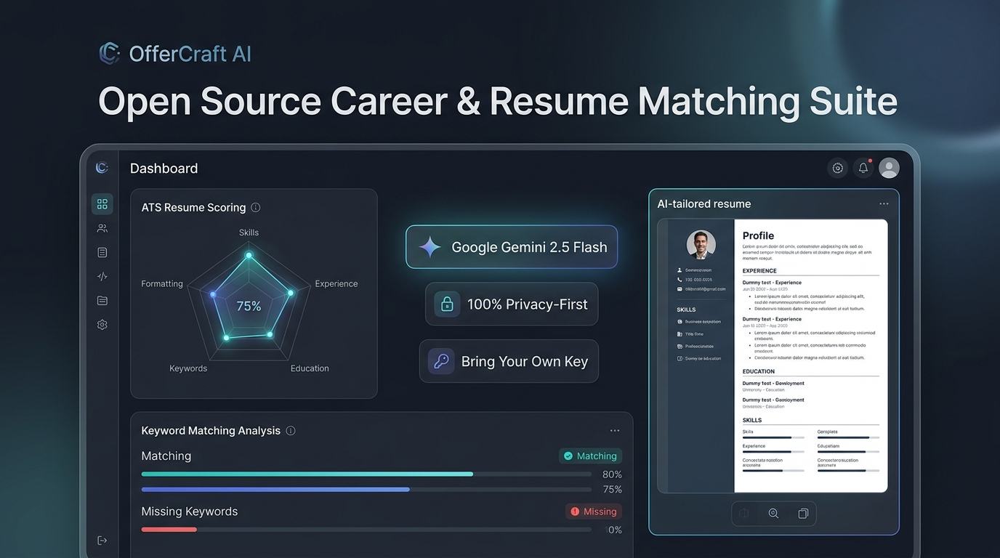
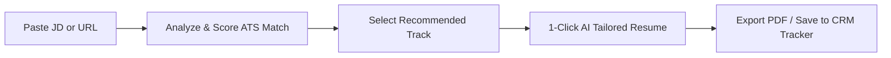

# 🚀 OfferCraft AI — Open-Source Executive Resume & Career Matching Suite

[](https://opensource.org/licenses/MIT)
[](https://www.python.org/)
[](https://flask.palletsprojects.com/)
[](https://aistudio.google.com/)
[]()



> **100% Free, Open-Source & Privacy-First Career Copilot** for tech leaders, program managers, and product professionals. Designed to bridge the gap between complex Job Descriptions (JDs) and executive resumes using Google Gemini AI.

---

## 🌟 Key Highlights

- **🔒 100% Local-First & Privacy-Focused**: Your resumes, contact details, notes, and CRM records are saved **only in your browser's local storage**. Nothing is saved on a central database or server disk.
- **🔑 Zero Cost / BYOK (Bring Your Own Key)**: Powered by Google AI Studio's free Gemini API tier (15 requests/minute for free with zero credit card required).
- **🎯 4 Multi-Track Master Resumes**: Pre-loaded with battle-tested starter templates for:
  - 🤖 **AI Transformation Manager** (Alex Morgan)
  - 📊 **Technical Program Manager (TPM)** (Jordan Lee)
  - 💻 **IT Delivery Manager (ITDM)** (Samantha Reid)
  - 📦 **Product Manager (PM)** (Taylor Brooks)
- **⚡ Instant ATS Match Scoring**: Live keyword parsing against curated 2025/2026 industry skill banks.
- **📝 Complete 1-Click Tailored Resumes**: Generate formatted Markdown resumes with keyword-dense bullets ready for single-click export to **Markdown** or **Printable PDF**.
- **✉️ Cover Letter & Recruiter InMail Pitch**: Instant customized cover letters and LinkedIn recruiter outreach notes tuned to the specific JD.
- **🗂️ Built-in Job Tracker (Kanban CRM)**: Manage your job pipeline (*Saved, Applied, Interviewing, Offered, Rejected*) directly in the app.
- **📊 Market Skill Heatmap & 1-Click Job Search**: Visualize high-demand skill gaps and launch 1-click targeted searches on LinkedIn, Google Jobs, and Indeed.

---

## 🛠️ Tech Stack & Architecture

```
OfferCraft-AI/
├── app.py                      # Flask Backend (Stateless API routes & analysis orchestration)
├── ai_enhancer.py              # Google Gemini API integration (Flash 2.5 / 2.0 / 1.5 with auto-fallback)
├── scorer.py                   # Multi-track keyword matching & ATS scoring engine
├── supplementary_keywords.py   # Curated industry keyword taxonomy (150+ categorized keywords)
├── default_templates.json      # Clean starter resumes and profile templates
├── master_resumes.json         # Base track resumes configuration
├── url_fetcher.py              # Smart Job Description fetcher from public career URLs
├── resume_parser.py            # PDF/DOCX/TXT multi-format resume parser
├── templates/
│   └── index.html              # Modern, responsive single-page application interface
└── static/
    ├── style.css               # Clean dark-mode CSS with glassmorphism & responsive layout
    └── main.js                 # Client-side reactivity, BYOK management, LocalStorage sync & charts
```

---

## 🚀 Quick Start Guide

### Prerequisites
- Python 3.9 or higher installed on your computer ([Download Python](https://www.python.org/downloads/))
- Git installed ([Download Git](https://git-scm.com/))
- A free Google Gemini API Key from [Google AI Studio](https://aistudio.google.com/app/apikey)

### Step 1: Clone the Repository
```bash
git clone https://github.com/harikiranchirala-AIworks/Resume-excel-utility-webui.git
cd Resume-excel-utility-webui
```

### Step 2: Install Required Dependencies
```bash
pip install -r requirements.txt
```

### Step 3: Run the Application
```bash
python app.py
```

### Step 4: Open in Browser
Visit **[http://127.0.0.1:5000](http://127.0.0.1:5000)** in your web browser.

---

## 🔑 Setting Up Your Free Gemini API Key

OfferCraft AI runs on **Google's Gemini Flash** models, which are available 100% free with generous rate limits (15 requests/minute).

1. Go to [Google AI Studio](https://aistudio.google.com/app/apikey) and sign in with your Google account.
2. Click **"Create API Key"** and copy your key.
3. In OfferCraft AI, click the **"🔑 Free AI Key"** button in the top navigation bar.
4. Paste your key and click **"🧪 Test & Save Key"**.
5. *Optional*: You can also create a `.env` file in the project root with:
   ```env
   GEMINI_API_KEY=your_gemini_api_key_here
   ```

---

## 📖 How to Use OfferCraft AI



1. **Set Up Your Profile**: Enter your contact details and customize your master track resumes in the **Candidate Profile** and **Master Resumes** tabs (saved automatically to your browser).
2. **Analyze a Job Description**: Paste a Job Description text or provide a job URL, then click **"🚀 Analyze Job Description"**.
3. **Review ATS Match & Skill Gaps**: View real-time match scores across all 4 tracks, radar charts, and covered vs. missing keywords.
4. **Tailor Resume & Collateral**:
   - Generate a customized, keyword-aligned resume in seconds.
   - Click **"✉️ Tailor Cover Letter"** for a tailored letter highlighting your relevant wins.
   - Click **"📩 Recruiter InMail"** to get a punchy outreach message for LinkedIn recruiters.
5. **Track Your Application**: Save the role directly to your built-in **Job Application Kanban CRM**.

---

## 💾 Data Portability & Backup

- **Export Backup**: Click **"💾 Export Data (JSON)"** in the header to download a complete backup of your customized profile, track resumes, and CRM job records.
- **Import Backup**: Transfer your settings to any computer with **"📂 Import Data"**.
- **Reset**: Easily reset to the clean starter templates at any time with **"🔄 Reset"**.

---

## 🤝 Contributing

Contributions are welcome! If you'd like to add new tracks, improve keyword taxonomy, or enhance UI features:

1. Fork the Project (`https://github.com/harikiranchirala-AIworks/Resume-excel-utility-webui/fork`)
2. Create your Feature Branch (`git checkout -b feature/NewFeature`)
3. Commit your Changes (`git commit -m 'Add some NewFeature'`)
4. Push to the Branch (`git push origin feature/NewFeature`)
5. Open a Pull Request

---

## 📜 License

Distributed under the **MIT License**. Free for personal and professional use.

Developed with ❤️ by **HARIKIRAN-AI WORKS**
